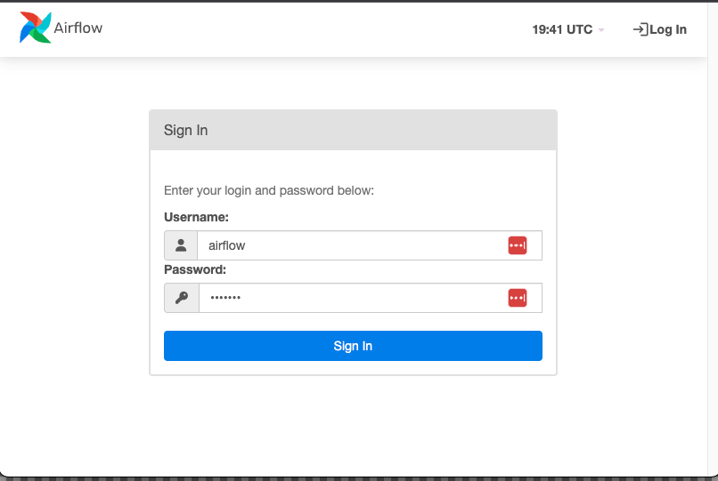

# 4-Automate-Data-Pipelines
1. [Instalar Airflow con docker](#schema1)
2 [Inicializar la base de datos y ejecutar airflow](#schema2)

<hr>
<a name='schema1'></a>

## 1. Instalar Airflow con docker

- Crear un directorio para el proyecto
- Ir a [Running Airflow in Docker](https://airflow.apache.org/docs/apache-airflow/stable/howto/docker-compose/index.html)
  - Navegar hasta el punto `Fetching docker-compose.yaml` y ejecutar en un terminal.
  ```
    curl -LfO 'https://airflow.apache.org/docs/apache-airflow/2.8.0/docker-compose.yaml'
  ```
  Y nos crea el archivo `docker-compose.yaml`
- Crear las carpetas necesarias para la ejecuación de Airflow
```
mkdir -p ./dags ./logs ./plugins ./config
```
-  Crear un archivo de entrono
```
echo -e "AIRFLOW_UID=$(id -u)" > .env
```

<hr>
<a name='schema2 '></a>

## 2. Inicializar la base de datos y ejecutar airflow
- Inicializar la base de datos
```
docker-compose up airflow-init
```
- Ejecutar airflow
```
docker-compose up -d
```
- Vamos al localhost http://localhost:8080/home



Tanto para el usuario y contraseña poner, airflow


<hr>
<a name='schemaref'></a>


https://www.youtube.com/watch?v=-kdgCWs86zohttps://www.youtube.com/watch?v=-kdgCWs86zo

https://airflow.apache.org/docs/apache-airflow/stable/howto/docker-compose/index.html